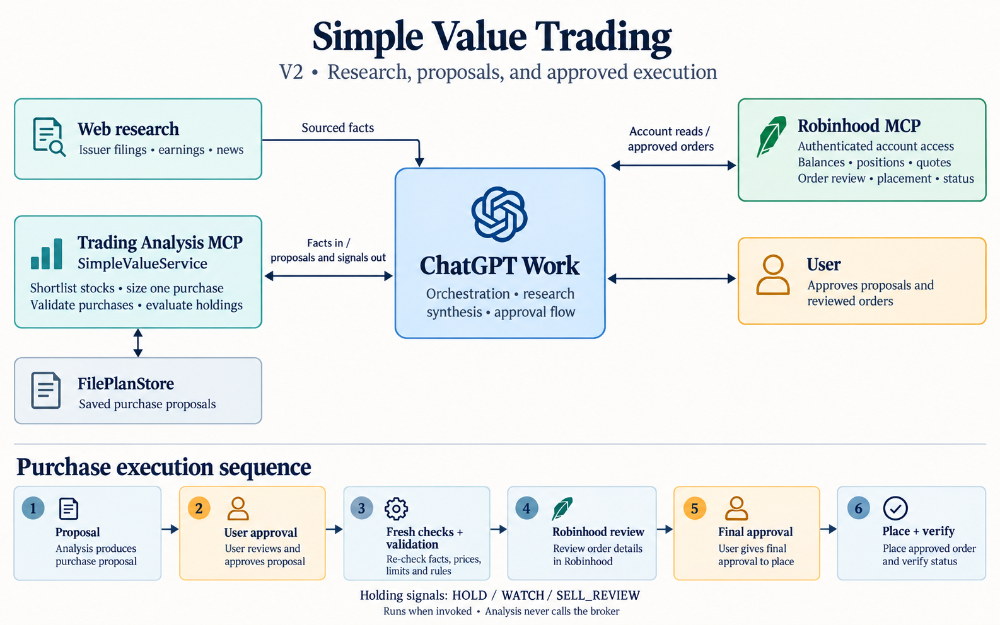

# Simple Value Trading

A personal stock-research workflow for ChatGPT Work and Robinhood.

Work searches the web, checks earnings and valuation data, and compares
candidates with the current portfolio. Purchases and sales require approval
in Work. Robinhood's authenticated MCP handles account access, order review,
placement, and status.

## Architecture



ChatGPT Work coordinates research and approvals. The analysis MCP returns
proposals and holding signals; Robinhood handles reviewed, approved orders.
The purchase flow includes proposal approval, fresh checks, broker review,
final approval, and order-status verification.

See the [architecture details](docs/architecture.md) for purchase and holding-review flows.

## Current workflow

V2 uses a custom analysis MCP to shortlist stocks, calculate purchase amounts,
and flag holdings for review.

- Screen for positive trailing EPS and a trailing P/E of 25 or less.
- Consider EPS growth, analyst targets, earnings announcements, and news.
- Shortlist up to five stocks and propose at most one new holding per run.
- Size purchases up to 20% of portfolio equity while reserving 10% cash.
- Monitor earnings deterioration, valuation, and profit-protection signals.

These are strategy rules, not guarantees. Some checks are implemented in the
analysis service; others rely on Work's instructions and Robinhood review.

V2 does not send SMS or iMessage notifications. Monitoring runs when the
workflow is invoked; the server does not run a background monitoring schedule.

## Use it

Copy the [Work prompt](docs/chatgpt-work-orchestration-prompt.md) into a task
with web research, Trading Analysis, and Robinhood available.

For an unattended research-and-monitoring run, use the
[scheduled Work prompt](docs/chatgpt-work-scheduled-monitor-prompt.md). It does
not authorize broker orders. The [portfolio dashboard](docs/PORTFOLIO_DASHBOARD.md)
shows holdings from a JSON snapshot generated by that run; it does not sync
directly with Robinhood.

See [setup](docs/chatgpt-work-setup.md) for the current MCP connection and
[workflow rules](docs/SIMPLE_WORKFLOW.md) for screening and sell signals.

The custom MCP is still part of the implementation. Removing it in favor of
Work instructions and calculations has been discussed but not implemented.

## Local development

```bash
python3 -m venv .venv
.venv/bin/pip install -r requirements.txt
.venv/bin/python scripts/run_analysis_mcp.py
```

The local endpoint is `http://127.0.0.1:8000/mcp`.

Run the V2 tests:

```bash
.venv/bin/python -m unittest discover -s tests -p 'test_simple_value_service.py'
```

## Earlier versions

[V1](archive/v1/README.md) is preserved at Git tag `v1`. Its backtests,
notification code, and other modules remain for reference. Historical V1
results do not establish the performance of the V2 workflow.
