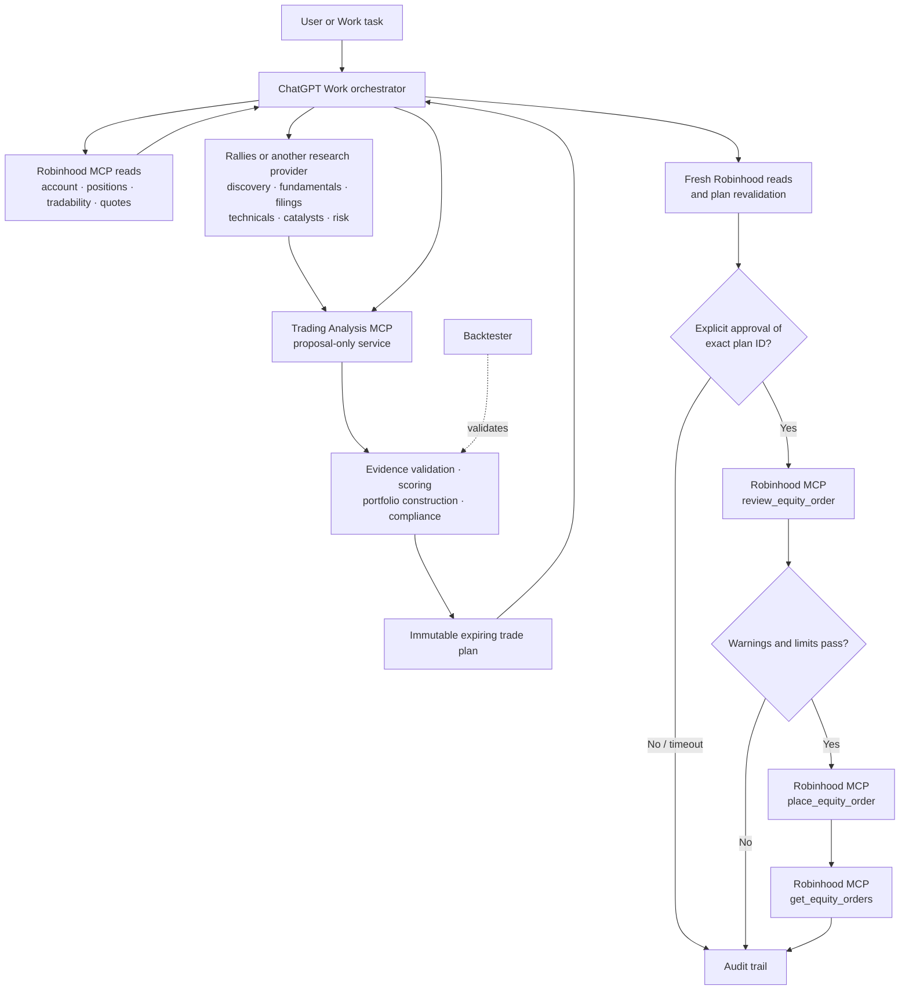

# Architecture

## Execution principle

The workflow is deliberately proposal-first. ChatGPT Work owns orchestration
and both MCP connections. The Trading Analysis MCP receives snapshots and
returns plans but has no broker credentials or execution tools. Live account
reads, order review, placement, and verification are performed only through
the separately authenticated official Robinhood Trading MCP.

See [ChatGPT Work setup](chatgpt-work-setup.md) for deployment and connection
instructions.

The legacy Rallies strategy remains solely as a backtest and comparison
baseline. It is not used by the Trading Analysis MCP. This is distinct from
using the read-only Rallies plugin as an external research provider: ChatGPT
Work can use that plugin to assemble candidate packets, but Rallies portfolios
or AI rankings are never accepted as target allocations without the normal
evidence validation and portfolio scoring.
