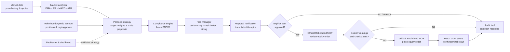

# Architecture

## Execution principle

The workflow is deliberately proposal-first. Local code can research,
backtest, and simulate. Live account reads and orders are performed only via
the browser-authenticated official Robinhood Trading MCP, with an explicit
approval and a post-submission verification step.
